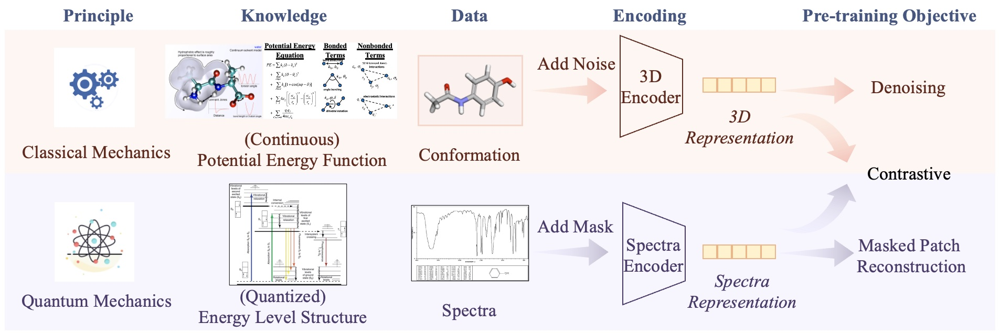

# MolSpectra: Pre-training 3D Molecular Representation with Multi-modal Energy Spectra



Implementation for paper: MolSpectra: Pre-training 3D Molecular Representation with Multi-modal Energy Spectra

This is the code for the ICLR'25 Paper: [MolSpectra: Pre-training 3D Molecular Representation with Multi-modal Energy Spectra](https://openreview.net/forum?id=xJDxVDG3x2).


## Usage

Please refer to the scripts in the `scripts/` directory for pre-training and fine-tuning.

## Requirements

* Python >= 3.10
* torch>=2.3.1
* torch_cluster>=1.6.3
* torch_geometric>=2.6.1
* torch_scatter>=2.1.2
* ase>=3.23.0
* h5py>=3.11.0
* matplotlib>=3.10.0
* numpy>=1.26.3
* pytorch_lightning>=1.3.8
* PyYAML>=5.4.1
* tqdm>=4.66.5

## Citation

Please cite our paper if you use the code:

```
@inproceedings{wang2025molspectra,
  author       = {Liang Wang and Shaozhen Liu and Yu Rong and Deli Zhao and Qiang Liu and Shu Wu and Liang Wang},
  title        = {MolSpectra: Pre-training 3D Molecular Representation with Multi-modal Energy Spectra},
  booktitle    = {ICLR},
  year         = {2025}
}
```
